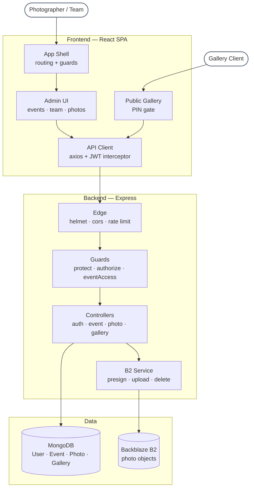
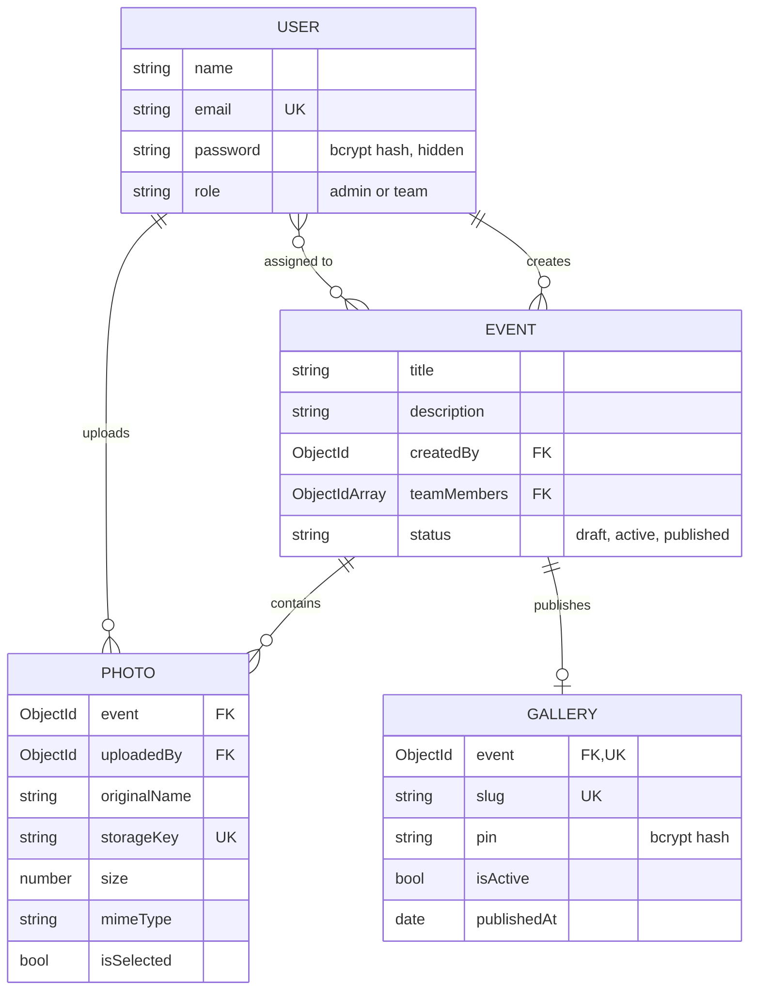
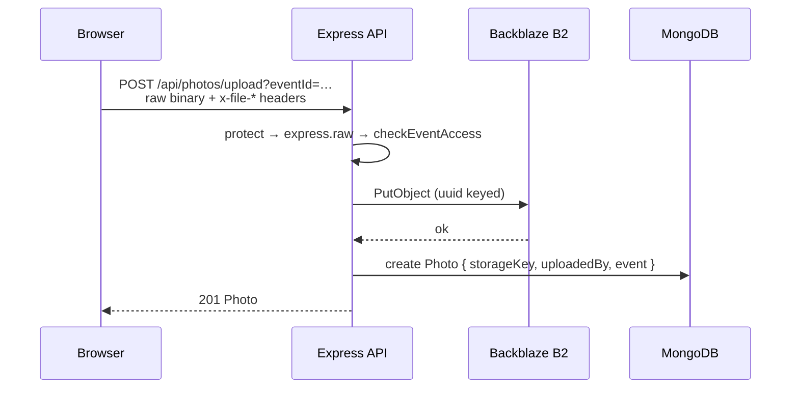
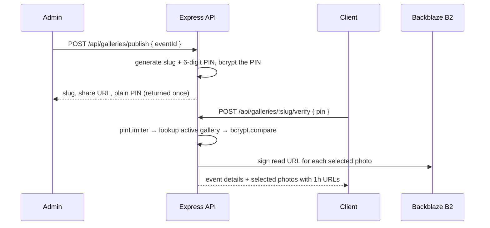

# Pixara — Architecture

A photo delivery platform for photographers. An admin creates an event, assigns team
members, photos get uploaded, the admin picks the keepers, and the client views them
through a PIN-protected public link.

---

## 1. Stack

| Layer | Choice |
|---|---|
| Frontend | React 19, TypeScript, Vite, Tailwind v4 |
| Client state | Zustand (auth, persisted to `localStorage`) |
| Server state | TanStack Query |
| Routing | React Router v7 |
| Backend | Node.js, Express |
| Database | MongoDB via Mongoose |
| Object storage | Backblaze B2, addressed through the AWS S3 SDK |
| Tests | Jest + Supertest (backend), Vitest + Testing Library (frontend) |

---

## 2. System overview



Requests always travel the same path: **edge → guards → controller → model or storage.**
Controllers never touch B2 directly; every object operation goes through `b2Service`.

---

## 3. Data model



One gallery per event, enforced by a unique index on `Gallery.event`.
`storageKey` is unique so a B2 object can never be recorded twice.

---

## 4. Authentication and authorization

Three independent layers, applied in order:

| Layer | File | Responsibility |
|---|---|---|
| `protect` | `middleware/auth.js` | Verifies the `Bearer` JWT, loads the user onto `req.user` |
| `authorize(...roles)` | `middleware/auth.js` | Coarse role gate — `admin` vs `team` |
| `checkEventAccess` | `middleware/eventAccess.js` | Per-resource gate — is this user on this event's `teamMembers`? |

Roles are exactly two:

- **`admin`** — global access to every event, the only role that can publish galleries,
  manage team members, or mark photos as selected.
- **`team`** — sees only events they are assigned to, and within an event only the
  photos they personally uploaded.

Role is never read from the request body on public signup; `register` hard-codes
`role: "team"`. Elevated accounts come only from `POST /api/auth/create-user`, itself
admin-gated.

---

## 5. Upload flow

The frontend uses a **server-side proxy**, not direct-to-B2. Presigned PUT URLs require
CORS configured on the B2 bucket; routing through the API sidesteps that entirely.



Reads are signed on demand: `getPhotosByEvent` attaches a fresh 1-hour `GetObject`
signed URL to every photo before responding. Nothing in the database stores a public URL.

> **Note.** `POST /api/photos/signed-url` and `POST /api/photos` implement the
> direct-to-B2 alternative (15-minute presigned PUT, then a metadata save). They are
> live but unused by the client — retained for server-to-server callers.

---

## 6. Gallery flow



Design points:

- The plain PIN is returned **only** in the publish response. `getGalleryCredentials`
  deliberately omits it thereafter.
- Only photos with `isSelected: true` ever leave the API on a public request.
- `pinLimiter` caps PIN attempts at 10 per IP per 15 minutes.
- Publishing flips the event's `status` to `published`.
- Verification is stateless: a correct PIN returns the signed URLs immediately, with no
  session or gallery token issued.

---

## 7. API surface

| Method | Route | Access |
|---|---|---|
| `POST` | `/api/auth/register` | Public — always creates a `team` user |
| `POST` | `/api/auth/login` | Public |
| `GET` | `/api/auth/me` | Authenticated |
| `GET` | `/api/auth/team-members` | Admin |
| `POST` | `/api/auth/create-user` | Admin |
| `GET`·`POST` | `/api/events` | Auth (list scoped by role) · Admin (create) |
| `GET`·`PUT`·`DELETE` | `/api/events/:id` | Event access · Admin · Admin |
| `PUT` | `/api/events/:id/team` | Admin |
| `POST` | `/api/photos/upload` | Event access |
| `POST` | `/api/photos/signed-url` | Event access |
| `POST` | `/api/photos` | Event access |
| `GET` | `/api/photos/event/:eventId` | Event access |
| `PATCH` | `/api/photos/:id/select` | Admin |
| `DELETE` | `/api/photos/:id` | Owner or admin |
| `POST` | `/api/galleries/publish` | Admin |
| `POST` | `/api/galleries/:slug/verify` | **Public**, rate limited |
| `GET` | `/api/galleries/event/:eventId` | Admin |
| `PATCH` | `/api/galleries/:id/deactivate` | Admin |

Every response follows the same envelope: `{ success, data }` or `{ success, message }`.

---

## 8. Frontend structure

```
src/
├── api/          axios instance + one module per domain
├── store/        Zustand auth store (persisted)
├── hooks/        TanStack Query hooks, one per operation
├── components/
│   ├── ui/       Button, Input — primitives
│   ├── layout/   AppLayout, Sidebar, Topbar, ProtectedRoute, AdminRoute
│   ├── events/   cards, modals, dialogs
│   ├── photos/   workspace, uploader, grid, lightbox
│   └── gallery/  PinGate, header, grid, lightbox
├── pages/        one folder per route group
└── types/        shared TypeScript contracts
```

**State split.** Server data (events, photos, galleries) lives in TanStack Query and is
never mirrored into Zustand. Zustand holds only auth — user, token, and the derived
`isAdmin` flag — persisted under the `photo-share-auth` key so a reload keeps the session.

**Route guards.** `ProtectedRoute` requires a token, `AdminRoute` requires `isAdmin`, and
both wrap `AppLayout`. `/gallery/:slug` sits outside both, so the admin chrome never
renders for a client.

**401 handling.** The axios response interceptor logs out and redirects on a 401, with
two deliberate exceptions: `/auth/login` and `/galleries/*`. Without them, a wrong
password or a wrong PIN would bounce the visitor instead of showing an inline error.

---

## 9. Security posture

| Control | Implementation |
|---|---|
| Password storage | bcrypt, cost 10, `select: false` on the field |
| PIN storage | bcrypt, never returned after publish |
| Transport auth | Stateless JWT, `Authorization: Bearer`, 7-day default expiry |
| Headers | `helmet()` on every response |
| Auth throttling | 20 requests / 15 min per IP on `/api/auth` |
| PIN throttling | 10 attempts / 15 min per IP |
| Input validation | `express-validator` + `validateObjectId` on every `:id` param |
| Object exposure | No public bucket URLs; every read is a 1-hour signed URL |

---

## 10. Known gaps

Ranked by impact. These are accurate as of this revision.

1. **Deleting an event orphans its data.** `deleteEvent` removes only the Event document.
   Photo rows, the Gallery row, and the B2 objects all survive. Needs a cascade, ideally
   a Mongoose `pre("deleteOne")` hook that clears B2 keys first.
2. **Republishing rotates the slug.** `publishGallery` mints a new slug on every call, so
   links already sent to a client break. Rotate the PIN, keep the slug.
3. **Body is buffered before authorization.** On `/photos/upload`, `express.raw` runs
   ahead of `checkEventAccess`, so up to 100 MB is read into memory before the event
   check runs. Move the access check in front of the body parser.
4. **`savePhotoMetadata` trusts a client `storageKey`.** A caller can record a Photo
   pointing at any object in the bucket. Only accept keys this server issued.
5. **No pagination.** `getPhotosByEvent` returns every photo and signs a URL for each.
   Large events cost one signing operation per photo per page load.
6. **`Photo` lacks an index on `event`**, the most frequent query, though `storageKey`
   is indexed.
7. **`apiLimiter` is defined but never mounted** — `/api/events` and `/api/photos` are
   unthrottled.
8. **`cors()` allows all origins.** Should be pinned to `FRONTEND_URL`.
9. **Error handling is inconsistent.** `errorHandler` is registered, but every controller
   catches and responds itself, so the handler only ever sees 404s.
